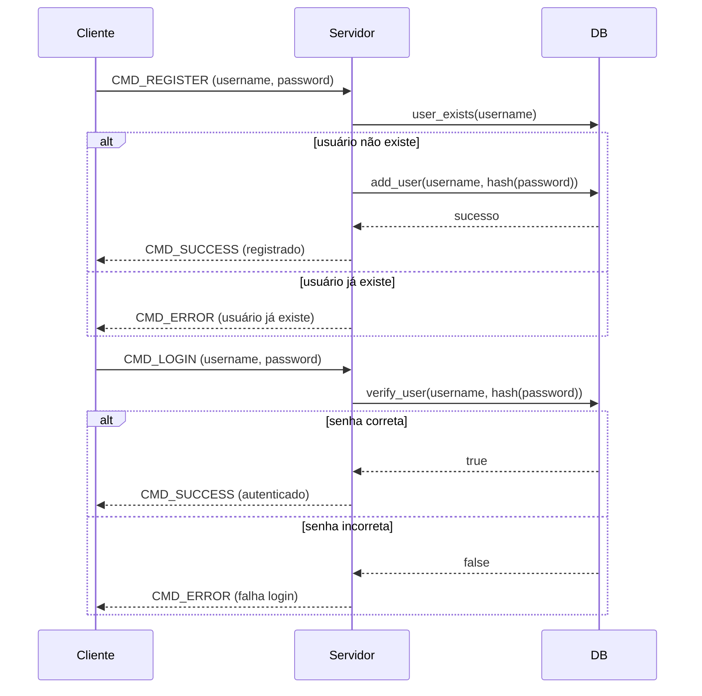

# Guia de Funcionamento

## Fluxo Principal do Servidor

1. Inicialização
   - `main()` em `server.c`:
     - Define a porta do servidor.
     - Inicializa o banco de dados (`init_database`).
     - Inicializa os gerenciadores de clientes e grupos.
     - Obtém o IP local da máquina (`get_local_ip`).
     - Cria e configura o socket do servidor (`setup_server_with_ip`).
     - Entra no loop principal de conexões.

2. Conexões de Clientes
   - A cada conexão aceita:
     - Cria uma `pthread` para lidar com o cliente (`client_handler`).
     - O socket do cliente é repassado para a thread.

3. Threads por Cliente
   - Cada cliente tem sua própria thread.
   - O cliente envia comandos.
   - A thread processa comandos de: login, registro, criar grupo, etc.
   - O estado do cliente é mantido na struct `User`.

## Conceitos Chave

### 1. Persistência com SQLite

- Arquivo: `db.c`
- Mantém a tabela `users` com `username` e `password`.
- Usa `mutex` para garantir segurança em acesso concorrente ao banco.

### 2. Autenticação e Registro

- Arquivo: `auth.c`
- `register_user()` verifica se o usuário existe, senão adiciona.
- `authenticate_user()` busca o hash da senha e compara com a senha fornecida.

### 3. Gerenciamento de Clientes e Grupos

- Arquivo: `chat.c`
- `ClientManager`: armazena todos os clientes conectados.
- `GroupManager`: controla os grupos de conversa.
- Cada grupo tem:
  - Nome.
  - Criador.
  - Lista de membros.
  - Mutex para controle de acesso.

### 4. Mensagens

- Struct `Message` em `common.h`:
  - `type`: tipo do comando (ex: CMD_LOGIN, CMD_MESSAGE, etc).
  - `username`, `password`, `groupname`, `message`: campos usados para cada comando.

## Fluxo de Registro e Login

##### Registro:

1. Cliente envia comando de registro com username/senha.
2. Servidor chama `register_user()`.
3. Se o usuário for novo, é salvo no banco.

##### Login:

1. Cliente envia comando de login com credenciais.
2. Servidor chama `authenticate_user()`.
3. Se correto, `authenticated = true` no struct `User`.

## Diagrama do funcionamento

